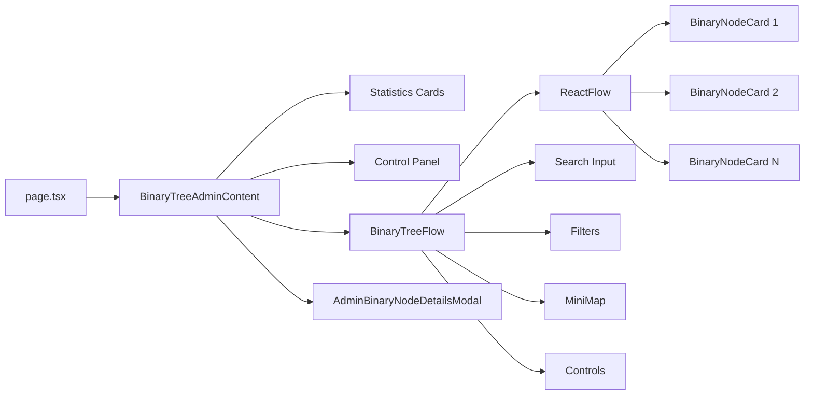
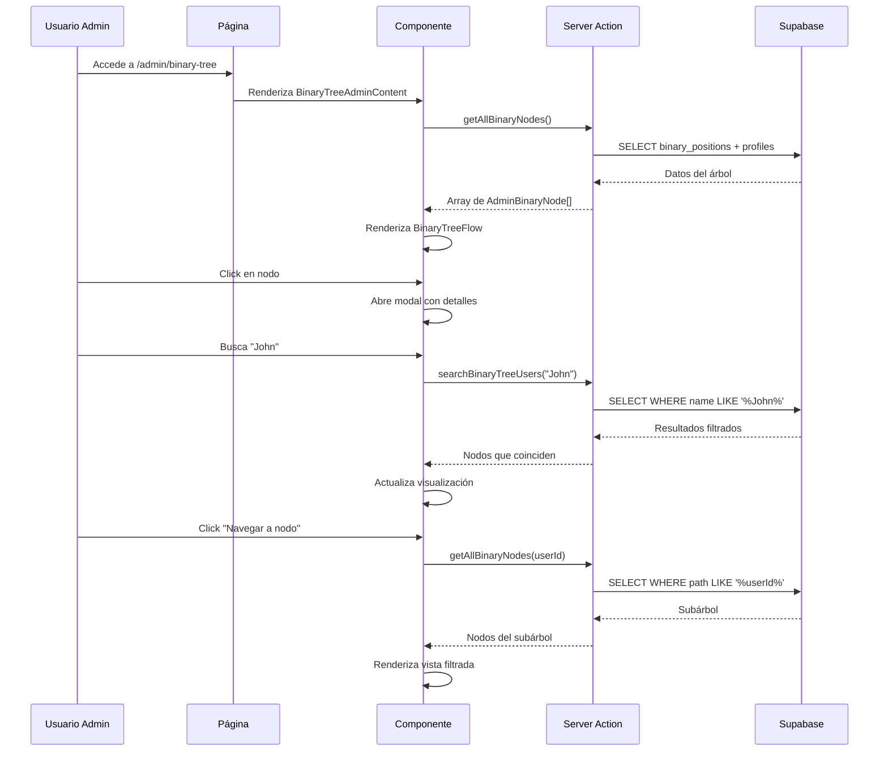
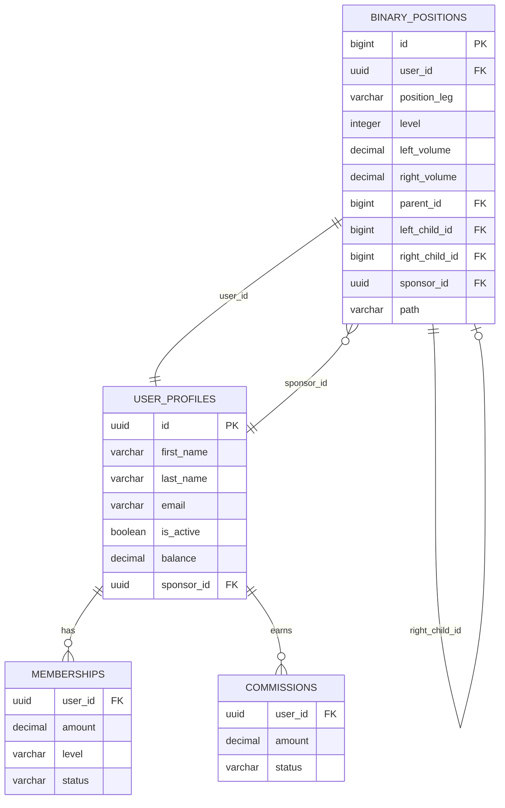
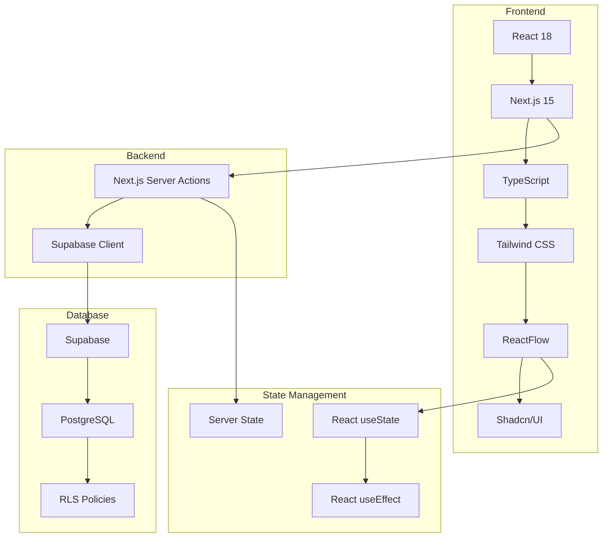
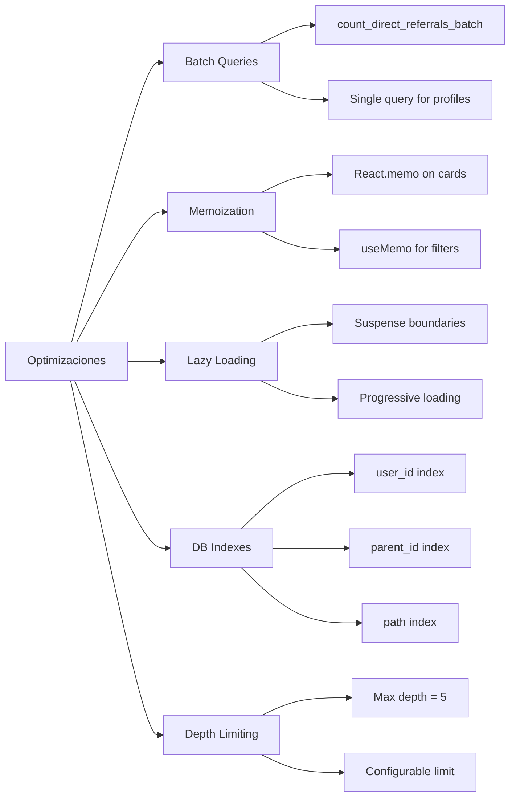
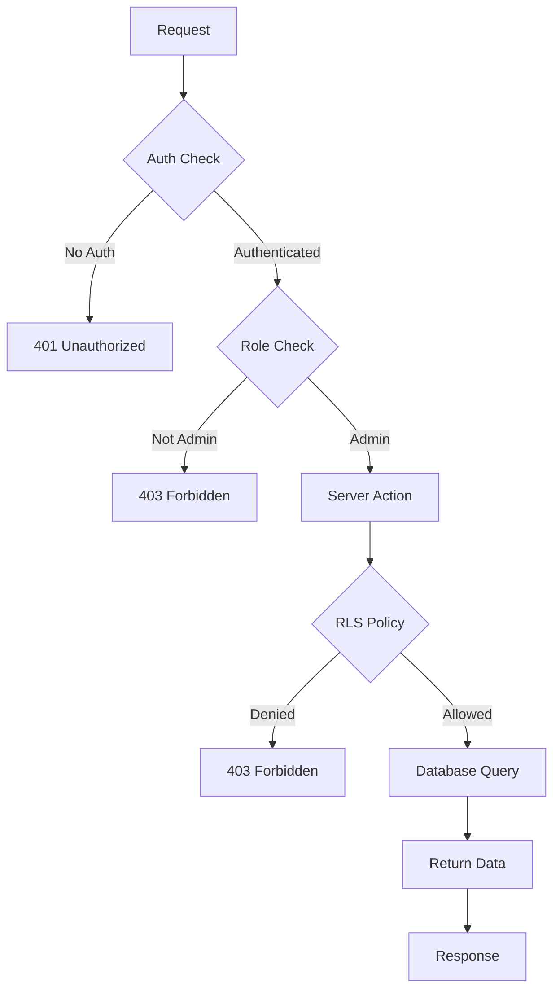
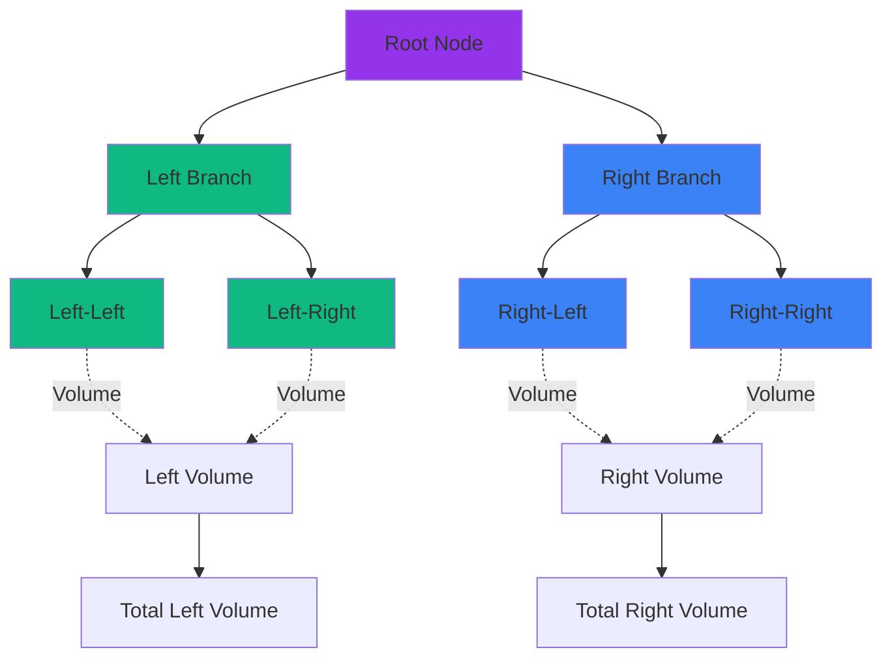
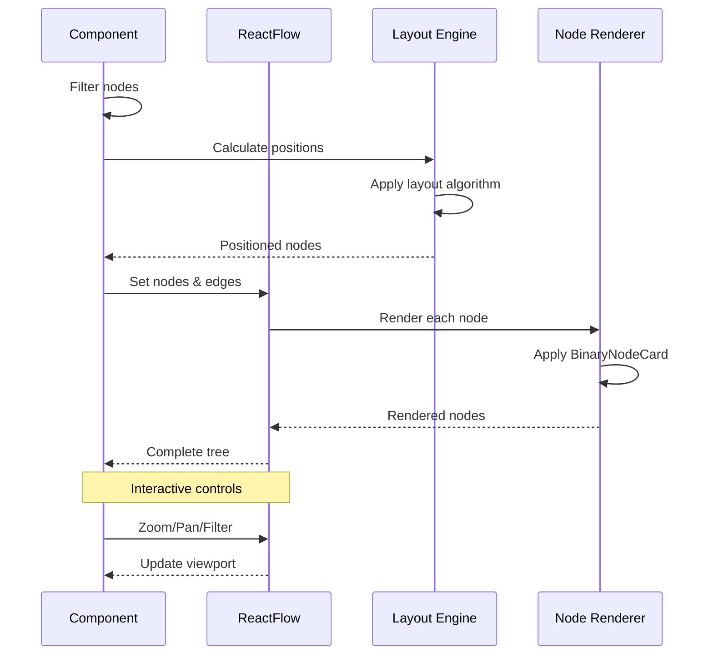
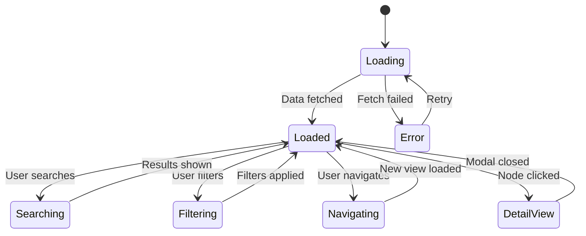

# Arquitectura del Sistema de Árbol Binario Admin

## Diagrama de Flujo de Datos

```mermaid
graph TB
    A[Admin Usuario] --> B[/admin/binary-tree]
    B --> C[BinaryTreeAdminContent]
    C --> D{Server Actions}
    
    D --> E[getAllBinaryNodes]
    D --> F[getBinaryTreeStatistics]
    D --> G[searchBinaryTreeUsers]
    D --> H[getAdminBinaryTree]
    
    E --> I[(Supabase DB)]
    F --> I
    G --> I
    H --> I
    
    I --> J[binary_positions]
    I --> K[user_profiles]
    I --> L[memberships]
    I --> M[commissions]
    
    C --> N[BinaryTreeFlow]
    N --> O[ReactFlow Engine]
    
    O --> P[BinaryNodeCard x N]
    P --> Q[Click Event]
    
    Q --> R[AdminBinaryNodeDetailsModal]
    
    N --> S[Search/Filter Panel]
    N --> T[Statistics Panel]
    N --> U[Controls Panel]
```

## Estructura de Componentes



## Flujo de Navegación



## Arquitectura de Datos



## Stack Tecnológico



## Optimizaciones Implementadas



## Seguridad en Capas



## Características del Árbol Binario



## Proceso de Renderizado



## Estados del Componente



Esta arquitectura asegura:
- ✅ Separación de responsabilidades
- ✅ Optimización de rendimiento
- ✅ Seguridad en múltiples capas
- ✅ Escalabilidad
- ✅ Mantenibilidad
