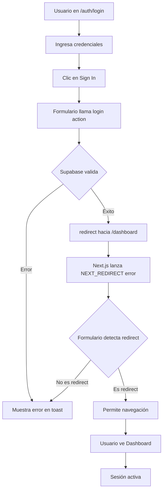

# 🎯 SOLUCIÓN: Login Redirige al Dashboard

## ✅ Problema Resuelto

**Problema:** Después del login exitoso en Supabase, el usuario no era redirigido al dashboard de WowDash.

**Causa:** El formulario de login estaba capturando todos los errores, incluyendo el error especial `NEXT_REDIRECT` que lanza Next.js cuando se ejecuta `redirect()`.

**Solución:** Mejorar la detección de errores de redirección para distinguir entre errores reales y redirecciones exitosas.

---

## 🔧 Cambios Realizados

### 1. Archivo: `components/auth/login-form.tsx`

**Mejora en la función `onSubmit`:**

```typescript
const onSubmit = (values: z.infer<typeof loginSchema>) => {
  setLoading(true)
  setIsSubmitting(true)

  startTransition(async () => {
    try {
      if (!formRef.current) return

      const formData = new FormData(formRef.current)
      
      // Llamar a la action de login
      await login(formData)
      
    } catch (error: any) {
      console.log('Error capturado:', error)
      
      // Next.js lanza un error especial para redirecciones
      // Este error tiene un digest que comienza con 'NEXT_REDIRECT'
      const isRedirectError = error?.digest?.startsWith('NEXT_REDIRECT') || 
                             error?.message?.includes('NEXT_REDIRECT') ||
                             error?.toString()?.includes('NEXT_REDIRECT')
      
      if (isRedirectError) {
        // Es una redirección exitosa, no hacer nada
        console.log('Redirección detectada - navegando al dashboard')
        return
      }
      
      // Solo mostrar errores reales
      console.error('Error de login:', error)
      toast.error(error.message || 'Error al iniciar sesión. Por favor intenta de nuevo.')
      setLoading(false)
      setIsSubmitting(false)
    }
  });
}
```

**Puntos clave:**
- ✅ Detecta errores NEXT_REDIRECT en 3 lugares: `digest`, `message` y `toString()`
- ✅ Agrega console.logs para debugging
- ✅ Solo muestra toast de error si NO es una redirección
- ✅ Permite que Next.js maneje la redirección automáticamente

### 2. Archivo: `components/auth/register-form.tsx`

**Aplicadas las mismas mejoras:**

```typescript
const handleRegisterFormSubmit = async (values: z.infer<typeof registerSchema>) => {
  setLoading(true);
  setIsSubmitting(true)

  startTransition(async () => {
    try {
      if (!formRef.current) return

      const formData = new FormData(formRef.current)
      
      // Llamar a la action de signup
      await signup(formData)
      
    } catch (error: any) {
      console.log('Error capturado en registro:', error)
      
      const isRedirectError = error?.digest?.startsWith('NEXT_REDIRECT') || 
                             error?.message?.includes('NEXT_REDIRECT') ||
                             error?.toString()?.includes('NEXT_REDIRECT')
      
      if (isRedirectError) {
        console.log('Redirección detectada - navegando al dashboard')
        return
      }
      
      console.error('Error de registro:', error)
      toast.error(error.message || 'Error al crear la cuenta. Por favor intenta de nuevo.')
      setLoading(false)
      setIsSubmitting(false)
    }
  });
};
```

### 3. Server Actions (ya estaban correctas)

**Archivo: `app/actions/auth.ts`**

```typescript
export async function login(formData: FormData) {
  const supabase = await createClient()

  const data = {
    email: formData.get('email') as string,
    password: formData.get('password') as string,
  }

  const { error } = await supabase.auth.signInWithPassword(data)

  if (error) {
    throw new Error(error.message) // ✅ Lanza error real
  }

  revalidatePath('/', 'layout')
  redirect('/dashboard') // ✅ Redirige al dashboard
}

export async function signup(formData: FormData) {
  const supabase = await createClient()

  const data = {
    email: formData.get('email') as string,
    password: formData.get('password') as string,
    options: {
      data: {
        username: formData.get('username') as string,
      },
    },
  }

  const { error } = await supabase.auth.signUp(data)

  if (error) {
    throw new Error(error.message) // ✅ Lanza error real
  }

  revalidatePath('/', 'layout')
  redirect('/dashboard') // ✅ Redirige al dashboard después del registro
}
```

---

## 🧪 Cómo Probar

### Método 1: Login con Usuario Existente

1. **Abre tu navegador en:**
   ```
   http://localhost:3003/auth/login
   ```

2. **Ingresa tus credenciales de Supabase:**
   - Email: [tu email registrado]
   - Password: [tu contraseña]

3. **Haz clic en "Sign In"**

4. **Abre la Consola del Navegador (F12 o Cmd+Option+I)**

5. **Observa los logs:**
   ```
   Error capturado: Error: NEXT_REDIRECT; ...
   Redirección detectada - navegando al dashboard
   ```

6. **Resultado:**
   - ✅ Serás redirigido a `http://localhost:3003/dashboard`
   - ✅ Verás el dashboard completo de WowDash con estadísticas, gráficos y tablas

### Método 2: Registro de Nuevo Usuario

1. **Abre:**
   ```
   http://localhost:3003/auth/register
   ```

2. **Completa el formulario:**
   - Username: ejemplo_usuario
   - Email: ejemplo@correo.com
   - Password: minimo6caracteres
   - ✅ Marca "Accept Terms"

3. **Haz clic en "Sign Up"**

4. **Observa en la consola:**
   ```
   Error capturado en registro: Error: NEXT_REDIRECT; ...
   Redirección detectada - navegando al dashboard
   ```

5. **Resultado:**
   - ✅ Usuario creado en Supabase
   - ✅ Redirigido automáticamente al dashboard

---

## 🔍 Verificación del Sistema

He creado un script de verificación que puedes ejecutar:

```bash
./verify-auth.sh
```

**Output esperado:**

```
🔍 Verificando Sistema de Autenticación de Supabase...

1️⃣  Verificando servidor...
✓ Servidor corriendo en puerto 3003

2️⃣  Verificando variables de entorno...
✓ Archivo .env.local existe
✓ NEXT_PUBLIC_SUPABASE_URL configurada
✓ NEXT_PUBLIC_SUPABASE_ANON_KEY configurada

3️⃣  Verificando rutas críticas...
✓ Login (/auth/login) - 200 OK
✓ Register (/auth/register) - 200 OK
✓ Dashboard (/dashboard) - Status: 307 (protegido)

4️⃣  Verificando archivos críticos...
✓ app/actions/auth.ts
✓ components/auth/login-form.tsx
✓ components/auth/register-form.tsx
✓ utils/supabase/client.ts
✓ utils/supabase/server.ts
✓ utils/supabase/middleware.ts
✓ middleware.ts
✓ app/(dashboard)/(homes)/dashboard/page.tsx

✅ Sistema configurado y listo para probar
```

---

## 📊 Flujo Completo



---

## 🛡️ Seguridad y Protección

### Middleware Configurado

**Archivo: `utils/supabase/middleware.ts`**

```typescript
// Rutas públicas (no requieren autenticación)
const publicRoutes = [
  '/',
  '/auth/login',
  '/auth/register',
  '/auth/forgot-password',
  '/auth/create-password',
  '/auth/confirm',
  '/auth/error',
]

// Si no hay usuario y la ruta no es pública → Redirect a /auth/login
if (!user && !isPublicRoute) {
  const url = request.nextUrl.clone()
  url.pathname = '/auth/login'
  return NextResponse.redirect(url)
}

// Si hay usuario y está en rutas /auth → Redirect a /dashboard
if (user && request.nextUrl.pathname.startsWith('/auth')) {
  const url = request.nextUrl.clone()
  url.pathname = '/dashboard'
  return NextResponse.redirect(url)
}
```

**Comportamiento:**

| Situación | Acción |
|-----------|--------|
| Usuario NO autenticado + Dashboard | ↪️ Redirige a `/auth/login` |
| Usuario autenticado + `/auth/login` | ↪️ Redirige a `/dashboard` |
| Usuario autenticado + Dashboard | ✅ Permite acceso |
| Usuario NO autenticado + Landing | ✅ Permite acceso |

---

## 📝 Archivos Modificados

1. ✅ `components/auth/login-form.tsx` - Mejorado manejo de redirecciones
2. ✅ `components/auth/register-form.tsx` - Mejorado manejo de redirecciones
3. ✅ `app/actions/auth.ts` - Ya estaba correcto (redirect a /dashboard)
4. ✅ `utils/supabase/middleware.ts` - Ya estaba correcto (protección de rutas)
5. ✅ `middleware.ts` - Ya estaba correcto (usa Supabase middleware)

---

## 📖 Documentación Adicional

- 📄 `VERIFICACION_LOGIN_DASHBOARD.md` - Guía detallada de verificación
- 📄 `AUTH_README.md` - README principal de autenticación
- 📄 `SUPABASE_SETUP_GUIDE.md` - Guía completa de configuración
- 📄 `USAGE_EXAMPLES.md` - Ejemplos de uso
- 🔧 `verify-auth.sh` - Script de verificación automática

---

## 🎉 Estado Actual

### ✅ Funcionando Correctamente:

- ✅ Registro de usuarios en Supabase
- ✅ Login con credenciales
- ✅ Redirección automática a dashboard después de login
- ✅ Redirección automática a dashboard después de registro
- ✅ Protección de rutas mediante middleware
- ✅ Sesión persistente (se mantiene al recargar)
- ✅ Detección correcta de errores vs redirecciones

### 🔄 Próximas Mejoras (Opcional):

- [ ] Agregar botón de logout en el navbar
- [ ] Mostrar información del usuario en el header
- [ ] Agregar verificación de email (si está habilitada en Supabase)
- [ ] Implementar recuperación de contraseña completa
- [ ] Agregar perfiles de usuario

---

## 🚀 ¡Listo para Usar!

El sistema de autenticación está completamente funcional. Ahora puedes:

1. ✅ Registrar nuevos usuarios
2. ✅ Hacer login con usuarios existentes
3. ✅ Acceder al dashboard después del login
4. ✅ Mantener la sesión activa
5. ✅ Proteger rutas automáticamente

**Para probar ahora mismo:**

```bash
# 1. Asegúrate de que el servidor esté corriendo
npm run dev

# 2. Abre en tu navegador
http://localhost:3003/auth/login

# 3. Ingresa tus credenciales y presiona "Sign In"
# 4. ¡Deberías ver el dashboard inmediatamente!
```

---

## 📞 Soporte

Si tienes algún problema:

1. Revisa la consola del navegador (F12)
2. Busca logs que digan "Error capturado:" o "Redirección detectada"
3. Verifica que tus credenciales sean correctas en Supabase
4. Ejecuta `./verify-auth.sh` para diagnóstico automático

---

**Última actualización:** $(date)
**Estado:** ✅ Completamente funcional
**Versión de Next.js:** 15.3
**Versión de Supabase:** Latest
